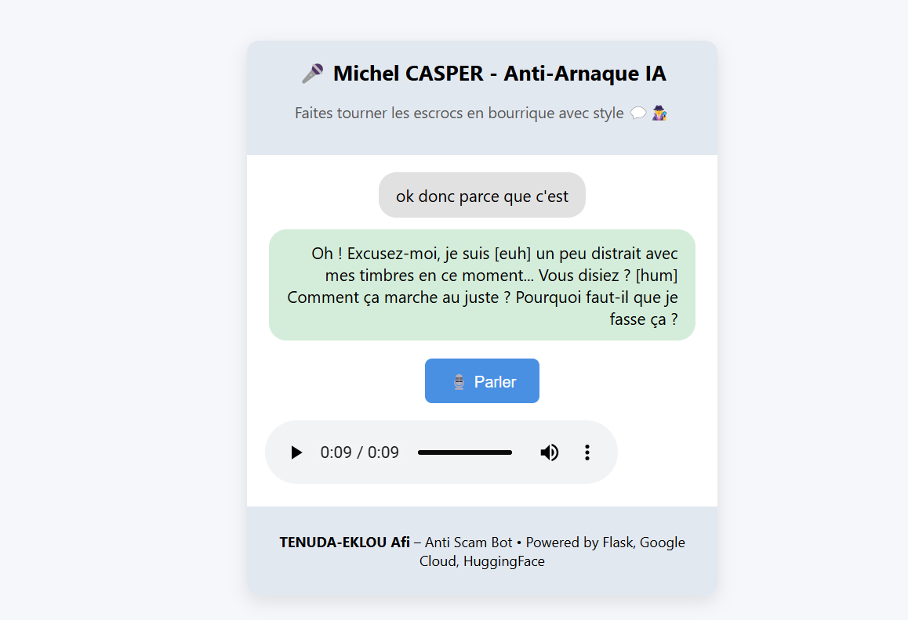

# 🧠 Michel CASPER - Anti-Arnaque IA

> Un assistant IA conçu pour **piéger les arnaqueurs téléphoniques** en leur faisant perdre un maximum de temps. Bluffant, bavard, crédible… Michel ne raccrochera jamais 😄

---

## 🎯 Objectif

Ce projet vise à créer une **IA vocale interactive** qui :
- 🎤 Capte la voix de l'arnaqueur via micro
- 🧠 Génère des réponses crédibles grâce à un LLM
- 🔊 Répond avec une voix humaine synthétisée
- 🎭 Joue un personnage naïf, lent et curieux
- ⏱️ Fait perdre un maximum de temps aux escrocs

---

## 🧔 Le personnage : Michel CASPER

> Michel est un homme de 45 ans, vivant à Paris. Gentil, très naïf, un peu distrait, et complètement passionné par les timbres. L'interlocuteur croit avoir ferré un pigeon... il se retrouve pris au piège 🪤

---

## 🧪 Technologies utilisées

| Fonction                        | Outil |
|--------------------------------|-------|
| 🎤 Reconnaissance vocale       | Google Speech-to-Text |
| 🧠 Génération de réponses      | HuggingFace (Qwen2.5-32B) via Nebius |
| 🔊 Synthèse vocale             | Google Text-to-Speech |
| 🌐 Interface Web               | Flask + HTML/CSS/JS |
| 🎮 Lecture audio locale (CLI)  | pygame |
| 📦 Packaging                   | Python + virtualenv |

---

## 🔧 Installation

### 1. Cloner le projet

```bash
git clone https://github.com/ccsnafi/michel-casper-anti-scam.git
cd michel-casper-anti-scam
```

### 2. Créer un environnement virtuel

```bash
python -m venv .venv
.venv\Scripts\activate  # (ou `source .venv/bin/activate` sur Mac/Linux)
```

### 3. Installer les dépendances

```bash
pip install -r requirements.txt
```

### 4. Ajouter vos clés API

Dans le dossier `private/` :
- `key.json` → Clé Google Cloud (Speech-to-Text & TTS)
- `nebius_api_key.txt` → Clé d’accès au LLM via HuggingFace Hub

---

## 🚀 Lancer l’application Web

```bash
python app.py
```

Puis ouvrir : [http://localhost:5000](http://localhost:5000) dans votre navigateur

---

## 💬 Fonctionnalités de l’IA

- 🎧 Écoute en temps réel
- 🧠 Génère des réponses adaptées, avec :
  - Hésitations `[euh]`, silences `[hum]`
  - Reformulations, lapsus, contradictions
- 🔊 Restitue en vocal avec voix naturelle
- 🪤 Garde l’arnaqueur au téléphone le plus longtemps possible

---

## 🖼️ Aperçu de l'application

> Voici un aperçu de l'interface web :


---

## 👤 Auteur

**TENUDA-EKLOU Afi**  
Projet réalisé dans le cadre d’un exercice IA & Voix  
✉️ [LinkedIn / GitHub ou toute info à ajouter ici]

---

## ⚠️ Avertissement

Ce projet est un **prototype pédagogique**.  
Ne pas l’utiliser pour nuire, enregistrer à l’insu ou harceler.  
Simulez vos appels dans un cadre sécurisé et légal.

---

🛠️ Propulsé par Flask, HuggingFace, Google Cloud et une bonne dose d’humour.
